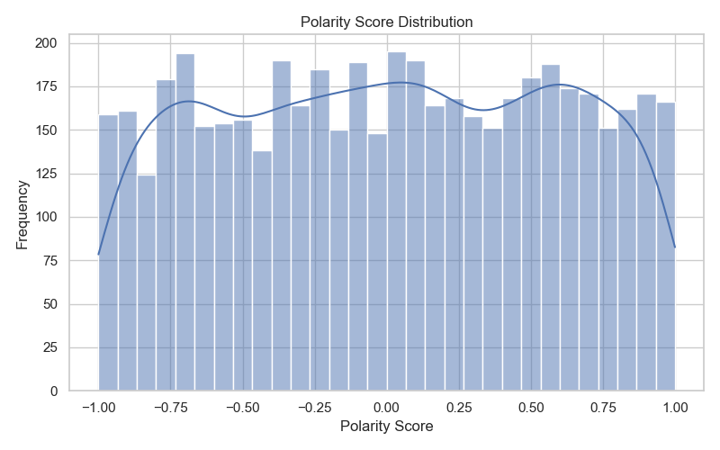
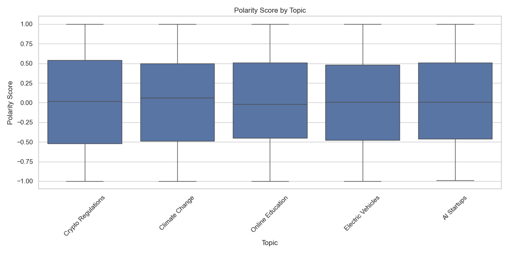

# Sentiment Analysis Project Report

## Data Overview
- **Source file:** Automatically detected CSV in the project directory
- **Columns:**
  - Date
  - Topic
  - Platform
  - Sentiment
  - PolarityScore
- **Total Rows:** 5000

## Methodology
1. **Data Loading & Inspection:**
   - Loaded the CSV file using pandas.
   - Inspected for missing values and dropped any incomplete rows (none found in this dataset).
2. **Summary Statistics:**
   - Provided descriptive statistics for all columns.
3. **Visualizations:**
   - Sentiment distribution
   - Polarity score distribution
   - Sentiment by platform
   - Polarity score by topic
   - Correlation heatmap for numeric columns
4. **Interactive Dashboard:**
   - Built with Streamlit for Power BI-like interactivity
   - Filters for Topic, Platform, and Sentiment
   - Dynamic, responsive charts and tables

---

## Key Visualizations

### 1. Sentiment Distribution

*Figure 1: Distribution of sentiment labels across the dataset.*

### 2. Polarity Score Distribution

*Figure 2: Histogram of sentiment polarity scores, showing the spread and intensity of sentiment.*

### 3. Sentiment by Platform

*Figure 3: Sentiment breakdown for each platform, highlighting where positive, negative, and neutral discussions occur.*

### 4. Polarity Score by Topic

*Figure 4: Boxplot of polarity scores for each topic, showing which topics are more polarizing or neutral.*

### 5. Correlation Heatmap

*Figure 5: Correlation heatmap for numeric columns (only PolarityScore in this dataset).* 

---

## Final Insights
- **Sentiment distribution** shows the overall mood of the data, with the most common sentiment being Positive.
- **Polarity Score distribution** reveals the intensity and spread of sentiment, ranging from -1 (most negative) to 1 (most positive).
- **Sentiment by platform** highlights which platforms have more positive or negative discussions.
- **Polarity Score by topic** shows which topics are more polarizing or neutral.
- **Correlation heatmap** (for numeric columns) helps identify relationships between features, though only PolarityScore is numeric in this dataset.

## How to Use
1. Install requirements:
   ```
   pip install -r requirements.txt
   ```
2. Run the interactive dashboard:
   ```
   streamlit run sentiment_dashboard.py
   ```
3. View static images in the `images/` folder for quick reference.

---

*This report was generated automatically as part of the data analysis project.* 